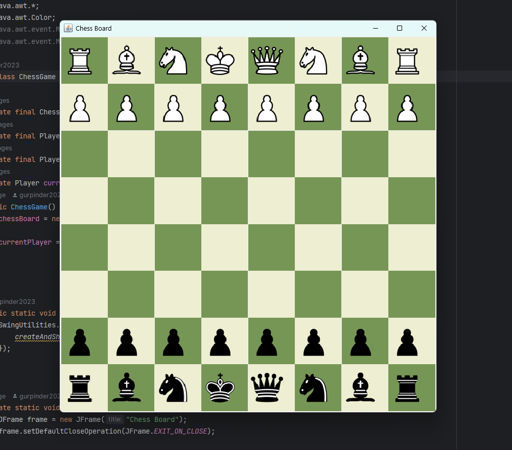

# ♟️ Chess Game

A fully functional **Chess Game** developed in **Java**, showcasing the principles of **Object-Oriented Programming (OOP)**. This project implements clean, modular, and maintainable code with an interactive GUI for an engaging user experience.


---

## 🌟 Features

- **Interactive GUI**: User-friendly interface built with **Java Swing**.
- **Object-Oriented Design**:
  - Encapsulation
  - Polymorphism
  - Inheritance
  - Abstraction
- **Chess Rules Enforcement**:
  - Turn-based gameplay.
  - Piece-specific movements.
  - Legal move validations.
- **Dynamic Chessboard**: Game state updates dynamically.
- **Custom Player Classes**: Logic for White and Black players encapsulated in separate classes.
- **Extensibility**: Designed to accommodate future enhancements.

---

## 📂 Project Structure
src/ ├── Bishop.java ├── ChessBoard.java ├── ChessGame.java ├── GUIManager.java ├── King.java ├── Knight.java ├── Pawn.java ├── Player.java ├── Queen.java ├── Rook.java ├── Piece.java .gitignore README.md

---

## 🛠️ Technologies Used

- **Programming Language**: Java
- **GUI Framework**: Java Swing
- **Development Environment**: IntelliJ IDEA

---

## 🧠 OOP Principles Applied

- **Encapsulation**: Each class encapsulates attributes and behaviors.
- **Inheritance**: Base `Piece` class extended by individual pieces (e.g., `King`, `Queen`, `Pawn`).
- **Polymorphism**: Overriding methods for piece-specific movement logic.
- **Abstraction**: Abstract classes define shared behaviors across components.

---

## 🚀 How to Run

1. **Clone the Repository**:
   ```bash
   git clone <repository-url>
2. **Open the Project:** : Open the project in your preferred IDE (e.g., IntelliJ IDEA or Eclipse).

3. **Compile and Run:** : Compile the code and run the ChessGame class to start the game.


---

## 📸 Screenshots


## 🌱 Future Enhancements
-**Add special moves like castling, en passant, and pawn promotion.**
-**Implement AI for single-player mode.**
-**Include a timer for moves.**
-**Save and load game states.**
-**Add multiplayer support with network programming.**
